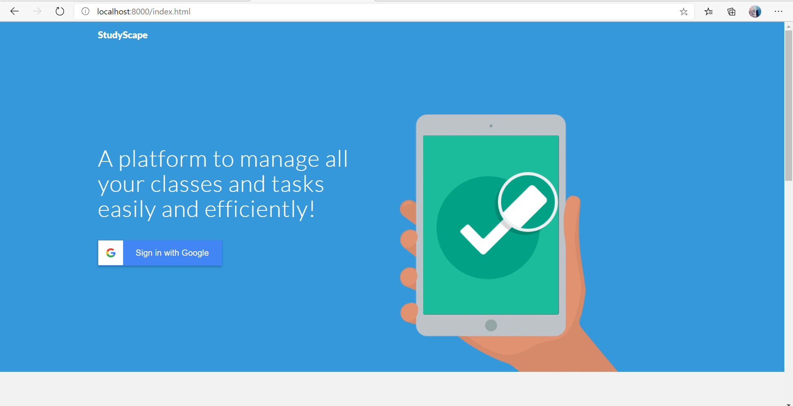
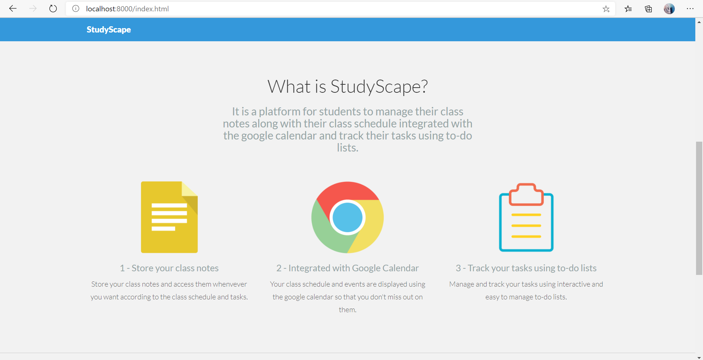
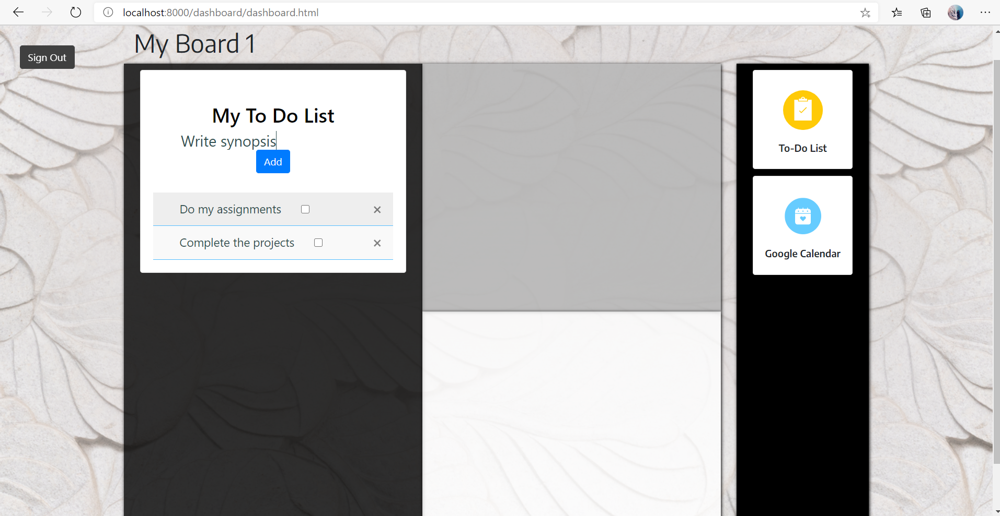

# StudyScape

Let StudyScape manage your school life easily, all in one place! Nowadays, there are too many individual tools to manage certain aspects of student life: multiple planner apps to manage your tasks, multiple online calendars, such as Google Calendar, to track your schedule, and so many more. We've eliminated the multitude of versions of the same concept and combined them in one nifty application: StudyScape!








## Setup
1. Create or sign in to your Github account.
2. Fork this [repository](https://github.com/MLH-Fellowship/Student-Planner)
3. Clone your fork of the repository and define an upstream remote pointing back to the Connectify repository that you forked in the first place.
```
git clone https://github.com/MLH-Fellowship/StudyScape.git 
cd StudyScape
git remote add upstream https://github.com/MLH-Fellowship/StudyScape.git
```
4. Start the server by running
```
python -m http.server
```
5. Open http://localhost:8000 in your preferred browser. 

## About the Project
Our dashboard is configured with Google sign-in, so you can use your Gmail account to sign in to our customizable dashboard. Here, you can drag and drop widgets into your dashboard to tailor it best to how you work! Our widgets include features such as:
 - Google Calendar, which can display your classes and events
 - To-do list, which lets you create multiple task lists. 


## Contributors
 - [Emily Amspoker](https://github.com/eamspoker)
 - [Vividha Rawat](https://github.com/V2dha)
 - [Shilpita Biswas](https://github.com/sh-biswas)
 
 ## Demo
https://www.youtube.com/watch?v=OE-mpeHPZxo&feature=youtu.be
